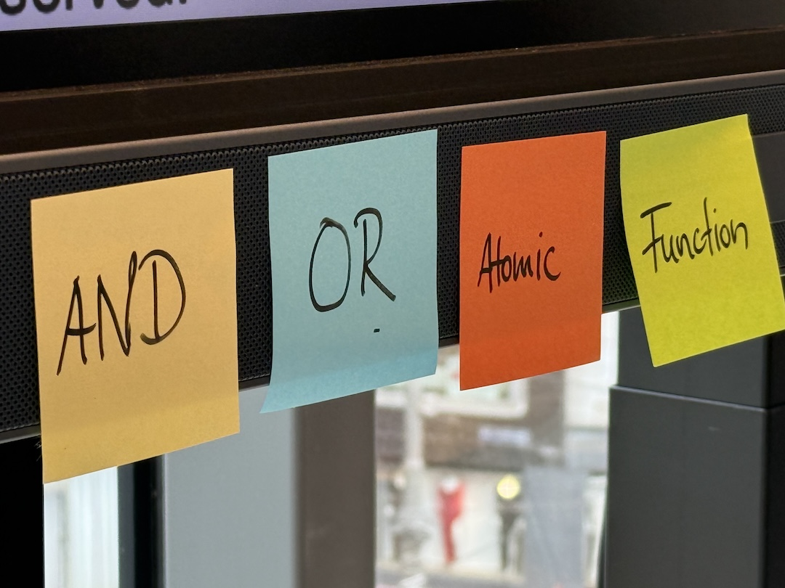
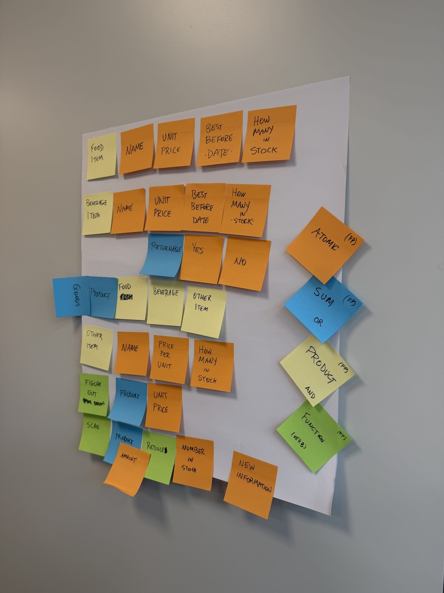
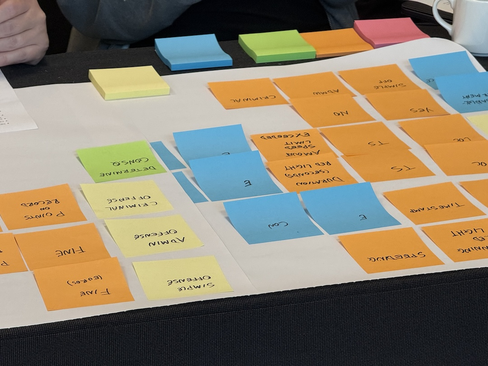
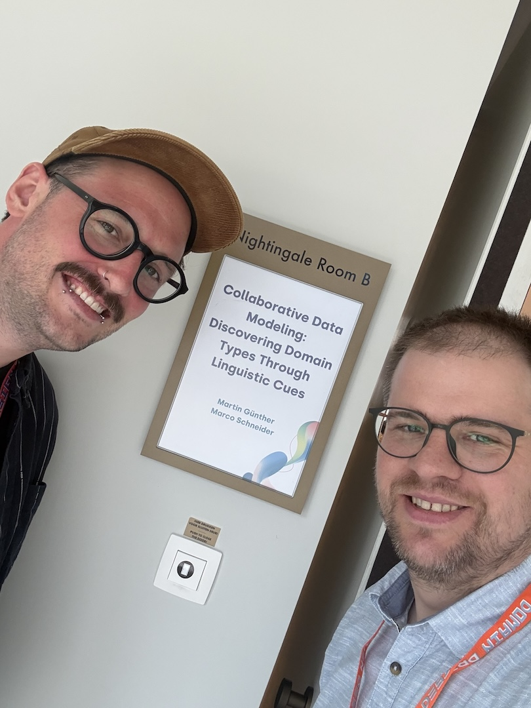

At the beginning of the year, I was introduced to [Martin
Günther](https://martinguenther-consulting.de/de/). Whereas I come from a
functional programming and data modeling background, Martin is an expert in
Domain-Driven Design Collaborative Modeling. It quickly became clear that we see
a lot of value in each others tools and techniques, while at the same time we
realized that there are some holes in our "own" techniques: On the one hand, the
DDD community seems to missing a systematic approach to date modeling that
functional programming techniques bring to the table. On the other hand, while
FP has the tools, the community is not always the most approachable and
communication (and collaboration) with domain experts is not our strong suit,
especially in groups of people with diverse (even non-technical) backgorunds.

After a short but intense collaboration, we came up with "Collaborative Data
Modeling": A sticky-note based technique, based on the idea of "design recipes"
from the book [*Schreibe dein Programm*](https://www.deinprogramm.de/sdp/) by
Michael Sperber and Herbert Klaeren, which establishes a systematic modeling
approach.

We were lucky enough to be accepted to *DDD Europe* in Antwerp this year with
our workshop ["Collaborative Data Modeling: Discovering Domain Types Through
Linguistic
Cues"](https://2026.dddeurope.com/program/collaborative-data-modeling-discovering-domain-types-through-linguistic-cues/)
and came home with lots of great experiences and good feedback.

We started writing down the technique as well. While it's still a work in
progress, you can read up on it [here](https://codeberg.org/margue/CoDaMo).

We are even more lucky in that [Andrea
Magnorsky](https://www.linkedin.com/in/magnorsky/) invited us to do an
online-version of our workshop for *Virtual Domain-Driven Design*. If you're
interested, come join us on September 3rd, 2026
[online](https://events.humanitix.com/collaborative-data-modelling-discovering-domain-types). We're
looking forward to modling with you!

